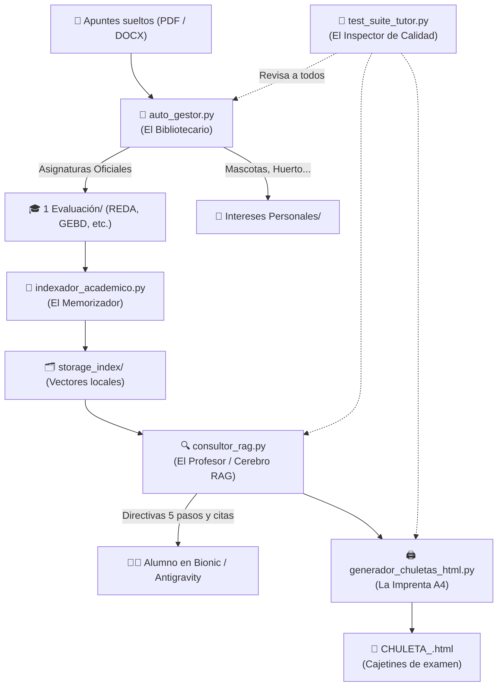

# 🗺️ MAPA MAESTRO DE SCRIPTS Y HERRAMIENTAS
**Tutor Académico Inteligente & Gestor de Biblioteca**  
*Guía visual y clara para no perderse nunca entre los archivos del sistema*

---

## 🎯 ¿Por qué hay varios scripts y cómo se relacionan?
Para que el sistema sea rápido, seguro y no falle, cada script tiene un **único trabajo bien definido**, como los miembros de un equipo de trabajo:
- Uno vigila y ordena las carpetas (el bibliotecario).
- Otro lee y memoriza los PDFs (el archivista).
- Otro busca las respuestas y las explica como profesor (el tutor).
- Otro imprime las chuletas en 1 hoja A4 (la imprenta).
- Y otro hace los exámenes de calidad (el inspector).

---

## 🧭 Diagrama Visual de Conexión

---

## 📚 Catálogo Detallado de Scripts (Uno a Uno)

### 🟢 FAMILIA 1: El Núcleo del Tutor (Los Motores)

#### 1. 📁 `auto_gestor.py` — El Bibliotecario y Centinela de Portadas
- **¿Qué es?:** El organizador de tus carpetas.
- **¿Para qué sirve?:**
  - Revisa la biblioteca en busca de archivos nuevos.
  - Lee la portada de los PDFs para saber de qué tratan.
  - **Diferencia si es de clase o una afición:** Si ve que habla de informática lo asocia a `1 Evaluación/`; si habla de cuidar gatos o cultivar tomates, propone moverlo a `Intereses Personales/`.
  - Mantiene actualizado el catálogo [`TEMARIO_ACTIVO.md`](file:///d:/Biblioteca_Temas/TEMARIO_ACTIVO.md).
- **¿Cómo se ejecuta?:**
  - Para auditar la biblioteca: `python "Plantemiento con indexacion/laboratorio_indexacion/auto_gestor.py"`
  - Para mover un archivo a su carpeta: `python "Plantemiento con indexacion/laboratorio_indexacion/auto_gestor.py" --organizar "archivo.pdf" "NombreCarpeta"`

#### 2. 🧠 `indexador_academico.py` — El Archivista / Memorizador Local
- **¿Qué es?:** El motor que lee los apuntes para que la IA los recuerde.
- **¿Para qué sirve?:**
  - Abre los PDFs y DOCXs de las asignaturas oficiales.
  - Los corta en trozos pequeños de 500 palabras y les calcula su significado semántico (*embeddings* locales en vectores).
  - Guarda la memoria en la carpeta `storage_index/<MATERIA>/` para que no haya que releer los PDFs cada vez.
- **¿Cómo se ejecuta?:**
  - Para indexar una materia: `python "Plantemiento con indexacion/laboratorio_indexacion/indexador_academico.py" --materia "REDA"`

#### 3. 🔍 `consultor_rag.py` — El Profesor / Cerebro RAG
- **¿Qué es?:** El buscador inteligente que responde a tus dudas.
- **¿Para qué sirve?:**
  - Cuando el alumno pregunta algo, busca en milisegundos los 2 o 3 párrafos exactos en `storage_index/`.
  - Activa la **etapa pedagógica solicitada**:
    - `glosario` (analogía cotidiana + formal + ejemplo).
    - `guia` (esquema Mermaid).
    - `entrenador` (taller práctico paso a paso).
    - `tribunal` (examen test de 4 opciones).
    - `chuleta` (datos clave ultracondensados).
  - Pone la **cita oficial de la página**: `[Fuente: Apunte.pdf, Página X]` para no inventar nada.
- **¿Cómo se ejecuta?:**
  - `python "Plantemiento con indexacion/laboratorio_indexacion/consultor_rag.py" --materia REDA --pregunta "¿Qué es una dirección IP?" --rol glosario`

---

### 🔵 FAMILIA 2: La Imprenta (Generadores de Material)

#### 4. 🖨️ `generador_chuletas_html.py` — La Imprenta de Chuletas A4
- **¿Qué es?:** El maquetador de fichas físicas de estudio.
- **¿Para qué sirve?:**
  - Crea una página web optimizada para imprimir o guardar en PDF (`Ctrl + P`).
  - **Ocupa exactamente 1 hoja A4** sin desbordarse (márgenes de 6 mm).
  - Dibuja la **escalera de divisiones sucesivas con cajetines tradicionales de examen** ($\lfloor\underline{\;2\;}$), restos en bolitas rojas, último cociente en verde y flecha de lectura.
  - Incluye diccionario flash, tablas de bases numéricas y semáforo con las 3 trampas mortales de examen.
- **¿Cómo se ejecuta?:**
  - Para generar la chuleta de Redes: `python "Plantemiento con indexacion/laboratorio_indexacion/generador_chuletas_html.py" --materia REDA`
  - La guarda en: `1 Evaluación/REDA.../CHULETA_REDA.html` y en `html/CHULETA_REDA.html`.

---

### 🟡 FAMILIA 3: Control de Calidad y Pruebas

#### 5. 🧪 `test_suite_tutor.py` — El Inspector de Calidad
- **¿Qué es?:** La ITV automática del sistema.
- **¿Para qué sirve?:**
  - Comprueba en 3 segundos que los 5 pilares funcionen correctamente:
    1. Detección de aficiones personales (gato / tomate).
    2. Detección de materias oficiales escolares.
    3. Calidad de la chuleta A4 y sus cajetines.
    4. Funcionamiento del motor RAG con citas por página.
    5. Separación en el catálogo `TEMARIO_ACTIVO.md`.
  - Da un resultado formal: `5/5 PRUEBAS COMPLETADAS CON ÉXITO`.
- **¿Cómo se ejecuta?:**
  - `python "Plantemiento con indexacion/laboratorio_indexacion/test_suite_tutor.py"`

#### 6. 💬 `simulador_tutor.py` — El Simulador de Chat por Consola
- **¿Qué es?:** Una sala de pruebas para chatear con el tutor desde la pantalla negra de la terminal.
- **¿Para qué sirve?:**
  - Te permite probar cómo responde el tutor a tus preguntas sin necesidad de abrir un navegador o Bionic.
- **¿Cómo se ejecuta?:**
  - `python "Plantemiento con indexacion/laboratorio_indexacion/simulador_tutor.py"`

---

### 📜 FAMILIA 4: Scripts Históricos / Anteriores

#### 7. ⏱️ `auto_vigilante.py` (Script de monitorización en bucle)
- **¿Qué es?:** Una primera versión del centinela creada en días anteriores.
- **Estado actual:** Sigue funcionando como un servicio que comprueba cada 30 segundos si hay archivos nuevos. Sus funciones de lectura de portadas y separación de ámbitos fueron absorbidas y perfeccionadas dentro de `auto_gestor.py`.
- **Recomendación:** No es necesario ejecutarlo manualmente; `auto_gestor.py` ya hace su trabajo de forma más completa.

---

## ⚡ Tabla Rápida: "¿Qué ejecuto según lo que quiera hacer?"

| Si lo que quieres es... | Ejecuta este comando en la terminal: |
| :--- | :--- |
| **Hacer una revisión rápida de que todo funciona** | `python "Plantemiento con indexacion/laboratorio_indexacion/test_suite_tutor.py"` |
| **Crear una chuleta en 1 hoja A4 para imprimir** | `python "Plantemiento con indexacion/laboratorio_indexacion/generador_chuletas_html.py" --materia REDA` |
| **Comprobar si hay PDFs nuevos sueltos en la carpeta** | `python "Plantemiento con indexacion/laboratorio_indexacion/auto_gestor.py"` |
| **Re-indexar los apuntes de una materia tras añadir temas** | `python "Plantemiento con indexacion/laboratorio_indexacion/indexador_academico.py" --materia REDA` |
| **Probar el RAG con una pregunta de examen** | `python "Plantemiento con indexacion/laboratorio_indexacion/consultor_rag.py" --materia REDA --pregunta "Sistemas de numeración" --rol glosario` |
| **Activar al tutor en Bionic con 1 clic** | Abre [`PROMPT_ACTIVACION_BIONIC.md`](file:///d:/Biblioteca_Temas/PROMPT_ACTIVACION_BIONIC.md) y copia el texto en el chat. |
