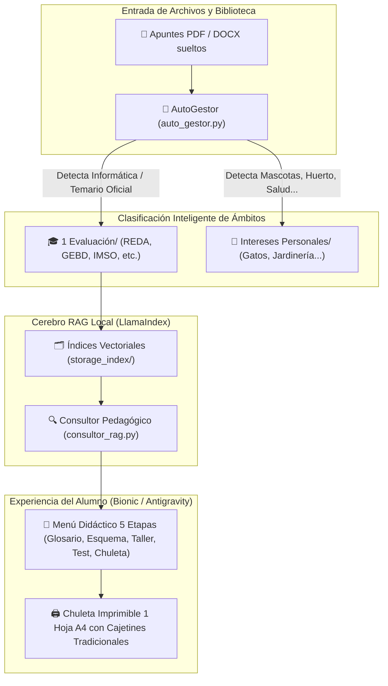

# 🎓 REVISIÓN GENERAL Y ESTADO INTEGRAL DEL PROYECTO
**Tutor Académico Inteligente & Gestor Autónomo de Biblioteca**  
*Fecha de auditoría: 17 de Septiembre de 2026 | Estado: Operativo y Validado*

---

## 🧭 1. Resumen Ejecutivo de la Arquitectura
El proyecto convierte un conjunto de carpetas y apuntes PDF en un **Tutor Académico Personalizado** y un **Bibliotecario Autónomo**, diseñado para alumnos que no necesitan saber nada de informática. Opera de forma 100% local, privada y sin dependencias obligatorias de la nube.

---

## 🔬 2. Diferenciación Técnica Clave: ¿Qué es RAG y qué es LlamaIndex?

| Concepto | Definición Técnica | Misión en el Proyecto |
| :--- | :--- | :--- |
| **RAG** *(Retrieval-Augmented Generation)* | Estrategia de recuperación de información antes de generar texto. | Evita que la IA invente datos. Obliga a que cada respuesta incluya citas oficiales por página: `[Fuente: REDA_01, pág. 8]`. |
| **LlamaIndex** | Librería / Motor en Python que implementa y gestiona el RAG. | Trocea los PDFs en fragmentos semánticos, calcula sus vectores y recupera en milisegundos el fragmento exacto que responde a la duda del alumno. |

---

## 🛡️ 3. Protocolo de Detección de Ámbitos: Materias vs. Aficiones
Uno de los mayores logros del sistema es **proteger el temario escolar para que nunca se contamine con temas personales**:

1. **Lectura Inteligente:** Al entrar un documento nuevo, se analizan el título y las primeras páginas.
2. **Comparación Curricular:** Se coteja contra el plan oficial (Redes, Bases de Datos, Sistemas Operativos, etc.).
3. **Detección de Afición / Interés Personal:**
   - Si se añade un PDF de cuidado felino (`Los 10 mandamientos para el cuidado de los gatos.pdf`), el sistema detecta términos zoológicos/veterinarios y diagnostica `0% coincidencia con Informática`.
   - Propone automáticamente la categoría: `Intereses Personales / Mascotas y Gatos`.
4. **Diálogo Respetuoso con el Estudiante:**
   - La IA no mueve nada sin permiso. Le muestra un aviso amigable:
     > *"He detectado que este archivo trata sobre cuidado de gatos y no entra en tus exámenes de clase. ¿Quieres que lo guarde en tu sección de Aficiones para que tus asignaturas escolares permanezcan 100% ordenadas?"*
5. **Aislamiento en Consultas:** Cuando el alumno pide un examen de Redes, la IA jamás mezcla datos de sus gatos con los protocolos de red.

---

## 📊 4. Inventario y Estado por Materias Oficiales

| Código | Asignatura Oficial | Estado RAG / Índice | Chuleta A4 Imprimible | Observaciones |
| :---: | :--- | :---: | :---: | :--- |
| **REDA** | Planificación y administración de redes | ✅ Indexado (`storage_index/REDA`) | ✅ Generada y Auditada (`CHULETA_REDA.html`) | Cajetines tradicionales en escalera validados en pantalla. |
| **GEBD** | Gestión de bases de datos | ✅ Indexado (`storage_index/GEBD`) | ✅ Generada (`CHULETA_GEBD.html`) | Tablas relacionales y reglas de integridad PK/FK. |
| **IMSO** | Implantación de sistemas operativos | ⏳ Carpeta creada | ⏳ Pendiente generación | Temario disponible en `1 Evaluación/`. |
| **LEMA** | Lenguajes de marcas y gestión de información | ⏳ Carpeta creada | ⏳ Pendiente generación | Temario disponible en `1 Evaluación/`. |
| **DISI** | Diseño de interfaces web | ⏳ Carpeta creada | ⏳ Pendiente generación | Temario disponible en `1 Evaluación/`. |

---

## 🎯 5. El Itinerario Pedagógico en 5 Etapas (El Menú del Alumno)
Cada vez que el alumno selecciona una materia, el tutor le presenta el menú interactivo para que decida libremente por dónde empezar:

1. **1️⃣ Paso 1: Glosario Intuitivo:** Desmitifica la jerga técnica con la tríada: analogía cotidiana para niños de 10 años + definición formal del apunte + ejemplo real.
2. **2️⃣ Paso 2: Guía Visual y Esencial:** Esquemas Mermaid de bloques (`flowchart`, `graph`) con los 3 a 5 pilares conceptuales sin paja teórica.
3. **3️⃣ Paso 3: Taller Práctico y Ejercicios Guiados:** Resolución de problemas paso a paso con fórmulas matemáticas en KaTeX y cajetines de libreta.
4. **4️⃣ Paso 4: Evaluación y Test de Examen:** 4 preguntas tipo test cerrado con distractores basados en errores comunes + 2 preguntas de razonamiento abierto.
5. **5️⃣ Paso 5: Chuleta de 1 Vistazo Imprimible:** Archivo HTML maquetado con `@media print` para exportar a PDF o imprimir en 1 solo folio A4 con márgenes de 6 mm.

---

## 📝 6. Lista de Verificación (Checklist de Seguimiento)
- [x] Motor RAG local con citas oficiales por página verificado.
- [x] Clasificación inteligente de archivos en `1 Evaluación/` vs `Intereses Personales/` implementada.
- [x] Generador de chuletas A4 con cajetines tradicionales de examen para divisiones sucesivas auditado en navegador.
- [x] Menú interactivo de 5 opciones integrado en el Skill.
- [x] Sincronización continua con el repositorio GitHub (`errobimd/tutor-academico-universal`).
- [ ] Ejecutar la generación masiva de chuletas A4 para `IMSO`, `LEMA` y `DISI`.
- [ ] Mover formalmente los archivos sueltos de gatos y tomates a `Intereses Personales/` previa confirmación.
